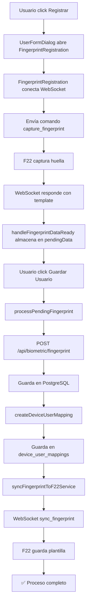
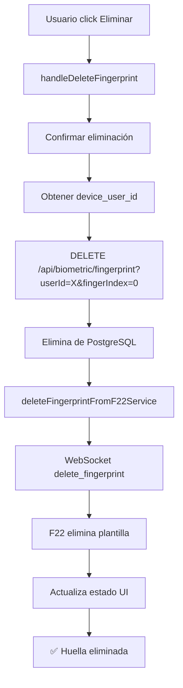
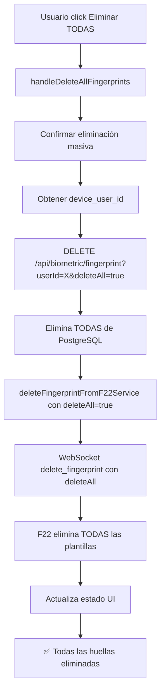

# 📋 COMPONENTES Y APIS DEL SISTEMA DE HUELLAS
**Fecha:** 11 de octubre de 2025  
**Sistema:** Gestión Biométrica de Huellas Dactilares

---

## 🎯 ORDEN DE FLUJO DEL SISTEMA

```
USUARIO → COMPONENTE → HOOK → API → BASE DE DATOS
                    ↓
              WEBSOCKET → DISPOSITIVO F22
```

---

## 📦 COMPONENTES PRINCIPALES

### **1️⃣ HOOK CENTRALIZADO**

#### **`src/hooks/useFingerprintManagement.ts`** (1145 líneas)
**Descripción:** Hook principal que centraliza toda la lógica de gestión de huellas

**Funciones exportadas:**
- `saveFingerprintToDatabase()` - Guarda huella en PostgreSQL
- `deleteFingerprintFromDatabase()` - Elimina huella(s) de BD
- `syncFingerprintToF22Service()` - Sincroniza con dispositivo F22 vía WebSocket
- `deleteFingerprintFromF22Service()` - Elimina del dispositivo F22
- `createDeviceUserMapping()` - Crea mapeo usuario-dispositivo
- `handleFingerprintDataReady()` - Procesa huella capturada
- `handleDeleteFingerprint()` - Flujo completo de eliminación individual
- `handleDeleteAllFingerprints()` - Flujo completo de eliminación masiva
- `processPendingFingerprint()` - Guarda huella pendiente en BD + F22
- `handleFingerprintDialogOpen()` - Abre diálogo de registro
- `handleFingerprintDialogClose()` - Cierra diálogo de registro
- `handleFingerprintError()` - Maneja errores

**Estados exportados:**
- `fingerprintState` - Estado completo del sistema
- `fingerprintDialogOpen` - Estado del diálogo
- `hasFingerprint` - Si el usuario tiene huella registrada
- `hasPendingFingerprint` - Si hay huella pendiente de guardar

**Constantes:**
- `MAX_RETRIES: 3` - Intentos de guardado en BD
- `WS_TIMEOUT: 15000` - Timeout WebSocket (15 segundos)
- `VALID_FINGER_INDICES: [0-9]` - Índices válidos de dedos

---

### **2️⃣ COMPONENTE DE REGISTRO**

#### **`src/components/biometric/FingerprintRegistration.tsx`** (1320 líneas)
**Descripción:** Modal para capturar huellas dactilares desde el dispositivo F22

**Props:**
```typescript
interface FingerprintRegistrationProps {
  open: boolean;                              // Estado del diálogo
  onClose: () => void;                        // Callback al cerrar
  user: {                                     // Usuario objetivo
    id: string;
    firstName: string;
    lastName: string;
    fingerprint?: boolean;
  };
  userType: 'empleado' | 'cliente';          // Tipo de usuario
  onFingerprintDataReady: (data: any) => void; // Callback con datos capturados
  onError?: (message: string) => void;        // Callback de error
}
```

**Características:**
- ✅ Selección de dedo (índices 0-9)
- ✅ Conexión WebSocket con F22 (ws://127.0.0.1:8085/ws/)
- ✅ Captura en tiempo real con feedback visual
- ✅ Validación de plantilla capturada
- ✅ Interfaz Material-UI responsive
- ✅ Indicadores de estado (esperando, capturando, éxito, error)
- ✅ Timeout automático de 15 segundos
- ✅ Reintentos automáticos

**Estados internos:**
- `status` - Estado del proceso (idle, connecting, capturing, success, error)
- `selectedFingerIndex` - Dedo seleccionado
- `ws` - Instancia WebSocket
- `deviceUserId` - ID asignado por F22

---

### **3️⃣ COMPONENTES DE GESTIÓN**

#### **A) `src/components/users/UserFormDialog.tsx`** (2253 líneas)
**Descripción:** Formulario principal para crear/editar usuarios/clientes

**Integración de huellas:**
- ✅ Importa `useFingerprintManagement` hook (línea ~71)
- ✅ Importa `FingerprintRegistration` componente (línea ~71)
- ✅ Inicializa hook con callbacks (línea ~234-260)
- ✅ UI de control de huellas (línea ~1234-1353):
  - Card con avatar de huella
  - Switch de activación
  - Botón "Registrar/Reemplazar Huella"
  - Botón "Eliminar" (si existe)
  - Botón "Eliminar TODAS" (si existen múltiples)
  - Alertas de estado (éxito/error/pendiente)
  - Validación de usuario no guardado
- ✅ Diálogo de registro (línea ~2246-2261)
- ✅ Procesamiento en submit (línea ~791-796)

**Flujo:**
1. Usuario abre diálogo → Activa switch de huella
2. Click en "Registrar/Reemplazar" → Abre `FingerprintRegistration`
3. Captura huella → Guarda en `fingerprintState.pendingData`
4. Usuario completa formulario → Click en "Guardar"
5. `handleSubmit` → Llama `processPendingFingerprint()`
6. Hook guarda en BD → Sincroniza con F22 → Crea mapping

---

#### **B) `src/components/employees/EmployeeFormDialog.tsx`**
**Descripción:** Formulario para gestión de empleados

**Integración de huellas:**
- ✅ Usa `FingerprintRegistration` directamente
- ✅ Gestión de huellas similar a UserFormDialog
- ✅ Validaciones específicas para empleados

---

#### **C) `src/components/biometric/FingerprintControl.tsx`** (Si existe)
**Descripción:** Componente de control visual de huellas (usado internamente)

**Características:**
- ✅ Indicadores visuales de estado
- ✅ Botones de acción
- ✅ Alertas y notificaciones
- ✅ Chips de información

---

### **4️⃣ SDK Y SERVICIOS**

#### **`src/services/biometric/zk9500-handler.ts`**
**Descripción:** Handler del SDK oficial de ZKTeco para lectores F22

**Funciones:**
- Comunicación con dispositivo biométrico
- Conversión de formatos de plantillas
- Validación de calidad de huella
- Comandos de bajo nivel al dispositivo

---

## 🔌 APIs RELACIONADAS

### **1️⃣ API PRINCIPAL DE HUELLAS**

#### **`/api/biometric/fingerprint/route.ts`** (565 líneas)
**Ubicación:** `src/app/api/biometric/fingerprint/route.ts`

**Endpoints:**

##### **GET - Obtener Huellas**
```typescript
GET /api/biometric/fingerprint
```

**Parámetros Query:**
- `userId` (string) - ID del usuario
- `getDeviceUserId` (boolean) - Obtener solo device_user_id
- Sin parámetros → Obtiene todas las huellas

**Respuestas:**
```typescript
// Con getDeviceUserId=true
{ device_user_id: number }

// Con userId
{ templates: FingerprintTemplate[] }

// Sin parámetros
{ templates: FingerprintTemplate[] }

// Error
{ error: string }
```

**Casos de uso:**
- Verificar si usuario tiene huellas
- Obtener device_user_id para sincronización
- Listar todas las huellas del sistema

---

##### **POST - Guardar Huella**
```typescript
POST /api/biometric/fingerprint
```

**Body:**
```typescript
{
  user_id: string;           // ID del usuario (requerido)
  template: string;          // Template Base64 (requerido)
  device_user_id: number;    // ID asignado por F22 (requerido)
  finger_index: number;      // Índice del dedo 0-9 (requerido)
  finger_name: string;       // Nombre del dedo (requerido)
  quality_score?: number;    // Calidad de la huella (opcional)
  is_active: boolean;        // Estado activo (default: true)
  created_at?: string;       // Timestamp (opcional)
  updated_by: string;        // Usuario que actualiza (requerido)
}
```

**Respuestas:**
```typescript
// Éxito
{
  success: true,
  data: {
    id: string,
    user_id: string,
    finger_index: number,
    created_at: string
  }
}

// Error
{
  success: false,
  error: string
}

// Sin contenido (204)
```

**Características:**
- ✅ Validaciones completas de campos requeridos
- ✅ Verificación de duplicados (user_id + finger_index)
- ✅ Actualización si ya existe
- ✅ Inserción si es nueva
- ✅ Respuestas JSON y 204
- ✅ Logging detallado

---

##### **DELETE - Eliminar Huella(s)**
```typescript
DELETE /api/biometric/fingerprint
```

**Parámetros Query:**
- `userId` (string, requerido) - ID del usuario
- `fingerIndex` (number, opcional) - Índice específico a eliminar
- `deleteAll` (boolean, opcional) - Eliminar todas las huellas

**Comportamiento:**
- Si `fingerIndex` presente → Elimina solo ese dedo
- Si `deleteAll=true` → Elimina todas las huellas del usuario
- Si ninguno → Error

**Respuestas:**
```typescript
// Éxito
{
  success: true,
  deletedCount: number,
  message: string
}

// Error
{
  success: false,
  error: string
}
```

**Ejemplos:**
```typescript
// Eliminar dedo específico
DELETE /api/biometric/fingerprint?userId=123&fingerIndex=0

// Eliminar todas
DELETE /api/biometric/fingerprint?userId=123&deleteAll=true
```

---

### **2️⃣ API DE GESTIÓN BIOMÉTRICA**

#### **`/api/biometric/manage/route.ts`**
**Ubicación:** `src/app/api/biometric/manage/route.ts`

**Endpoints:**

##### **POST - Gestión de Dispositivo**
```typescript
POST /api/biometric/manage
```

**Body:**
```typescript
{
  action: 'sync' | 'delete' | 'status' | 'reset';
  userId?: string;
  deviceId?: string;
  data?: any;
}
```

**Acciones disponibles:**
- `sync` - Sincronizar usuario con dispositivo
- `delete` - Eliminar usuario del dispositivo
- `status` - Obtener estado del dispositivo
- `reset` - Resetear dispositivo

**Respuestas:**
```typescript
{
  success: boolean,
  message: string,
  data?: any
}
```

---

### **3️⃣ API DE MAPEO DISPOSITIVO-USUARIO**

#### **Tabla: `device_user_mappings`**
**Acceso:** Vía Supabase Client en `useFingerprintManagement.ts`

**Operaciones:**

##### **Crear/Actualizar Mapping**
```typescript
// Función: createDeviceUserMapping()
// Ubicación: useFingerprintManagement.ts línea ~93

await supabase
  .from('device_user_mappings')
  .insert({
    user_id: string,
    device_user_id: number,
    device_id: string,
    device_type: string,
    is_active: boolean,
    created_at: string,
    updated_at: string
  });
```

##### **Consultar Mapping**
```typescript
await supabase
  .from('device_user_mappings')
  .select('*')
  .eq('user_id', userId)
  .eq('device_id', deviceId)
  .single();
```

---

### **4️⃣ WEBSOCKET API (Servicio F22)**

#### **`ws://127.0.0.1:8085/ws/`**
**Descripción:** WebSocket del servicio local que controla el dispositivo F22

**Mensajes enviados:**

##### **1. Conectar Dispositivo**
```json
{
  "type": "device",
  "action": "connect",
  "data": {
    "deviceType": "F22",
    "deviceId": "F22_001"
  }
}
```

##### **2. Capturar Huella**
```json
{
  "type": "device",
  "action": "capture_fingerprint",
  "data": {
    "deviceType": "F22",
    "deviceId": "F22_001",
    "userId": "user-123",
    "fingerIndex": 0
  }
}
```

##### **3. Sincronizar Huella**
```json
{
  "type": "device",
  "action": "sync_fingerprint",
  "data": {
    "deviceType": "F22",
    "deviceId": "F22_001",
    "deviceUserId": 1001,
    "userId": "user-123",
    "template": "base64-encoded-template",
    "fingerIndex": 0,
    "fingerName": "Índice Derecho",
    "userName": "Juan Pérez"
  }
}
```

##### **4. Eliminar Huella**
```json
{
  "type": "device",
  "action": "delete_fingerprint",
  "data": {
    "deviceType": "F22",
    "deviceId": "F22_001",
    "deviceUserId": 1001,
    "userId": "user-123",
    "fingerIndex": 0,        // null para eliminar todas
    "deleteAll": false       // true para eliminar todas
  }
}
```

---

**Mensajes recibidos:**

##### **1. Bienvenida**
```json
{
  "type": "welcome",
  "action": "connected",
  "message": "Conectado al servidor WebSocket"
}
```

##### **2. Dispositivo Conectado**
```json
{
  "type": "device",
  "action": "connect",
  "status": "success",
  "message": "Dispositivo F22 conectado"
}
```

##### **3. Captura Exitosa**
```json
{
  "type": "device",
  "action": "capture_fingerprint",
  "status": "success",
  "data": {
    "template": "base64-encoded-template",
    "device_user_id": 1001,
    "finger_index": 0,
    "finger_name": "Índice Derecho",
    "quality_score": 95
  }
}
```

##### **4. Sincronización Exitosa**
```json
{
  "type": "device",
  "action": "sync_fingerprint",
  "status": "success",
  "data": {
    "deviceUserId": 1001,
    "fingerIndex": 0,
    "message": "Huella sincronizada exitosamente"
  }
}
```

##### **5. Eliminación Exitosa**
```json
{
  "type": "device",
  "action": "delete_fingerprint",
  "status": "success",
  "data": {
    "deletedTemplates": 1,
    "userDeleted": false
  }
}
```

##### **6. Error**
```json
{
  "type": "device",
  "action": "any_action",
  "status": "error",
  "error": "Descripción del error"
}
```

---

## 📊 FLUJO COMPLETO DE OPERACIONES

### **1️⃣ REGISTRAR HUELLA**



---

### **2️⃣ ELIMINAR HUELLA INDIVIDUAL**



---

### **3️⃣ ELIMINAR TODAS LAS HUELLAS**



---

## 🗄️ BASE DE DATOS

### **Tabla: `fingerprint_templates`**

**Schema:**
```sql
CREATE TABLE fingerprint_templates (
  id UUID PRIMARY KEY DEFAULT uuid_generate_v4(),
  user_id VARCHAR(255) NOT NULL,
  device_user_id INTEGER NOT NULL,
  finger_index INTEGER NOT NULL CHECK (finger_index >= 0 AND finger_index <= 9),
  finger_name VARCHAR(50) NOT NULL,
  template TEXT NOT NULL,
  quality_score INTEGER CHECK (quality_score >= 0 AND quality_score <= 100),
  is_active BOOLEAN DEFAULT TRUE,
  created_at TIMESTAMPTZ DEFAULT NOW(),
  updated_at TIMESTAMPTZ DEFAULT NOW(),
  updated_by VARCHAR(100),
  
  UNIQUE(user_id, finger_index)
);

CREATE INDEX idx_fingerprint_user_id ON fingerprint_templates(user_id);
CREATE INDEX idx_fingerprint_device_user_id ON fingerprint_templates(device_user_id);
```

---

### **Tabla: `device_user_mappings`**

**Schema:**
```sql
CREATE TABLE device_user_mappings (
  id UUID PRIMARY KEY DEFAULT uuid_generate_v4(),
  user_id VARCHAR(255) NOT NULL,
  device_user_id INTEGER NOT NULL,
  device_id VARCHAR(100) NOT NULL,
  device_type VARCHAR(50) NOT NULL DEFAULT 'F22',
  is_active BOOLEAN DEFAULT TRUE,
  created_at TIMESTAMPTZ DEFAULT NOW(),
  updated_at TIMESTAMPTZ DEFAULT NOW(),
  
  UNIQUE(user_id, device_id)
);

CREATE INDEX idx_mapping_user_id ON device_user_mappings(user_id);
CREATE INDEX idx_mapping_device_user_id ON device_user_mappings(device_user_id);
```

---

## 📝 RESUMEN JERÁRQUICO

### **NIVEL 1: COMPONENTES DE PRESENTACIÓN**
1. `UserFormDialog.tsx` - Formulario de usuarios
2. `EmployeeFormDialog.tsx` - Formulario de empleados
3. `FingerprintRegistration.tsx` - Diálogo de captura

### **NIVEL 2: LÓGICA DE NEGOCIO**
4. `useFingerprintManagement.ts` - Hook centralizado

### **NIVEL 3: SERVICIOS**
5. `zk9500-handler.ts` - SDK ZKTeco

### **NIVEL 4: APIs REST**
6. `/api/biometric/fingerprint` - CRUD de huellas
7. `/api/biometric/manage` - Gestión de dispositivos

### **NIVEL 5: COMUNICACIÓN EN TIEMPO REAL**
8. WebSocket `ws://127.0.0.1:8085/ws/` - F22 Service

### **NIVEL 6: PERSISTENCIA**
9. `fingerprint_templates` - Tabla de plantillas
10. `device_user_mappings` - Tabla de mapeos

---

## 🎯 COMPONENTES POR RESPONSABILIDAD

### **📱 INTERFAZ DE USUARIO (Frontend)**
- `UserFormDialog.tsx`
- `EmployeeFormDialog.tsx`
- `FingerprintRegistration.tsx`
- `FingerprintControl.tsx`

### **🔧 LÓGICA DE NEGOCIO (Frontend)**
- `useFingerprintManagement.ts`

### **🛠️ SERVICIOS (Frontend)**
- `zk9500-handler.ts`

### **🌐 APIs (Backend)**
- `/api/biometric/fingerprint/route.ts`
- `/api/biometric/manage/route.ts`

### **🔌 COMUNICACIÓN TIEMPO REAL**
- WebSocket Server (Puerto 8085)

### **💾 BASE DE DATOS**
- `fingerprint_templates` (Supabase/PostgreSQL)
- `device_user_mappings` (Supabase/PostgreSQL)

---

## ✅ CHECKLIST DE INTEGRACIÓN

Para integrar el sistema de huellas en un nuevo componente:

- [ ] Importar `useFingerprintManagement` hook
- [ ] Importar `FingerprintRegistration` componente
- [ ] Inicializar hook con callbacks (`onSuccess`, `onError`)
- [ ] Agregar botón para abrir `FingerprintRegistration`
- [ ] Implementar callback `handleFingerprintDataReady`
- [ ] Agregar botones de eliminación (individual y masiva)
- [ ] Llamar `processPendingFingerprint()` en submit
- [ ] Mostrar estado con `fingerprintState`
- [ ] Validar usuario guardado antes de capturar

---

**Última actualización:** 11 de octubre de 2025  
**Documentado por:** GitHub Copilot
