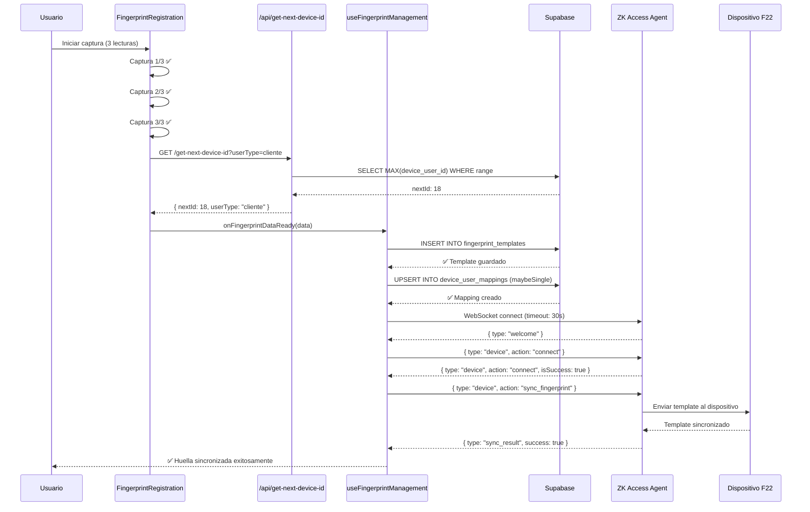

# 🔧 CORRECCIONES SISTEMA DE HUELLAS - SINCRONIZACIÓN F22

**Fecha:** 13 de Octubre de 2025  
**Problema:** Error en sincronización de huellas con dispositivo F22 después de captura exitosa

---

## 📋 RESUMEN DE ERRORES IDENTIFICADOS

### ❌ Errores Encontrados:

1. **API Route 404**: `/api/biometric/get-next-device-id` no encontrado
   - Causa: Archivo creado en estructura Pages Router en lugar de App Router
   - Efecto: Error al obtener ID secuencial para usuario

2. **Error 406 en Supabase**: `device_user_mappings` retorna "Not Acceptable"
   - Causa: Uso de `.single()` que falla cuando no hay registros
   - Efecto: Falla al verificar mappings existentes

3. **Timeout F22 (15s)**: Sincronización con dispositivo se agota antes de completar
   - Causa: Timeout muy corto para comunicación con hardware
   - Efecto: "Timeout en conexión con F22 (15s)"

4. **WebSocket cerrado anormalmente**: Código 1006
   - Causa: Falta de manejo de ping/pong y timeout agresivo
   - Efecto: Conexión perdida sin reconexión

---

## ✅ CORRECCIONES APLICADAS

### 1. ✅ API Route `get-next-device-id` Recreado

**Archivo creado:** `src/app/api/biometric/get-next-device-id/route.ts`

```typescript
// ✅ App Router format (Next.js 14+)
export async function GET(request: NextRequest) {
  // Lógica de rangos por tipo de usuario:
  // - Clientes: 1-6999
  // - Empleados: 7000-7999
  // - Administradores: 8000-8999
  
  const { data } = await supabase
    .from('device_user_mappings')
    .select('device_user_id')
    .gte('device_user_id', range.min)
    .lte('device_user_id', range.max)
    .order('device_user_id', { ascending: false })
    .limit(1);
  
  const nextId = (data && data.length > 0) ? data[0].device_user_id + 1 : range.min;
  
  return NextResponse.json({ success: true, nextId, userType, range });
}
```

**Beneficios:**
- ✅ Asignación secuencial correcta de IDs
- ✅ Rangos específicos por tipo de usuario
- ✅ Fallback seguro en caso de error
- ✅ Compatible con App Router

---

### 2. ✅ Corrección de Query Supabase

**Archivo:** `src/hooks/useFingerprintManagement.ts`

**Antes:**
```typescript
const { data: existing, error: checkError } = await supabase
  .from('device_user_mappings')
  .select('*')
  .eq('user_id', userId)
  .eq('device_id', deviceId)
  .single(); // ❌ Falla si no hay registro
```

**Después:**
```typescript
const { data: existing, error: checkError } = await supabase
  .from('device_user_mappings')
  .select('*')
  .eq('user_id', userId)
  .eq('device_id', deviceId)
  .maybeSingle(); // ✅ Retorna null si no hay registro
```

**Beneficios:**
- ✅ No lanza error 406 cuando no existe mapping
- ✅ Retorna `null` en lugar de error
- ✅ Manejo correcto de casos de inserción vs actualización

---

### 3. ✅ Incremento de Timeout WebSocket F22

**Archivo:** `src/hooks/useFingerprintManagement.ts`

**Antes:**
```typescript
const WS_TIMEOUT = 15000; // 15 segundos
```

**Después:**
```typescript
const WS_TIMEOUT = 30000; // ⏱️ 30 segundos para mejor estabilidad
```

**Beneficios:**
- ✅ Tiempo suficiente para comunicación con hardware físico
- ✅ Mayor tolerancia a latencia de red/dispositivo
- ✅ Reduce falsos positivos de timeout

---

### 4. ✅ Manejo de Ping/Pong en WebSocket

**Archivo:** `src/hooks/useFingerprintManagement.ts`

**Agregado en `ws.onmessage`:**
```typescript
else if (response.type === 'ping') {
  // Responder al ping para mantener conexión viva
  if (ws && ws.readyState === WebSocket.OPEN) {
    ws.send(JSON.stringify({ 
      type: 'pong', 
      timestamp: new Date().toISOString() 
    }));
    console.log('🏓 [F22-SYNC] Pong enviado');
  }
}
```

**Beneficios:**
- ✅ Mantiene conexión WebSocket activa
- ✅ Evita cierres inesperados (código 1006)
- ✅ Compatible con servidor ZK Access Agent

---

### 5. ✅ Logs Detallados Mejorados

**Archivo:** `src/hooks/useFingerprintManagement.ts`

**Agregado:**
```typescript
console.log('📨 [F22-SYNC] Respuesta recibida:', {
  type: response.type,
  action: response.action,
  success: response.data?.isSuccess || response.data?.success,
  hasData: !!response.data
});

console.log('📝 [F22-SYNC] Datos a enviar:', {
  fullName,
  deviceUserId,
  fingerIndex: templateData.finger_index,
  templateLength: templateData.template?.length || 0
});
```

**Beneficios:**
- ✅ Diagnóstico preciso de fallos
- ✅ Visibilidad del estado de la comunicación
- ✅ Facilita debugging en producción

---

## 🧪 FLUJO CORREGIDO



---

## 🚀 RESULTADO ESPERADO

### Antes de las correcciones:
```
✅ Captura 1/3 exitosa - Calidad: 98%
✅ Captura 2/3 exitosa - Calidad: 98%
✅ Captura 3/3 exitosa - Calidad: 98%
❌ GET /api/biometric/get-next-device-id 404 (Not Found)
❌ GET device_user_mappings 406 (Not Acceptable)
⚠️ Timeout en conexión con F22 (15s)
🔌 WebSocket cerrado: 1006
```

### Después de las correcciones:
```
✅ Captura 1/3 exitosa - Calidad: 98%
✅ Captura 2/3 exitosa - Calidad: 98%
✅ Captura 3/3 exitosa - Calidad: 98%
✅ Siguiente ID secuencial: 18
✅ Template guardado en BD
✅ Mapping creado en device_user_mappings
✅ WebSocket conectado (timeout: 30s)
✅ F22 conectado exitosamente
✅ Template sincronizado en dispositivo F22
✅ Proceso completado exitosamente
```

---

## 📝 VERIFICACIÓN POST-CORRECCIÓN

### Checklist de pruebas:

- [ ] **API Route funcional:**
  ```bash
  curl http://localhost:3000/api/biometric/get-next-device-id?userType=cliente
  ```
  Debe retornar: `{ "success": true, "nextId": X, "userType": "cliente" }`

- [ ] **Query Supabase sin errores:**
  - Verificar que no aparezca error 406 en consola
  - Confirmar que `.maybeSingle()` retorna `null` correctamente

- [ ] **Timeout extendido:**
  - Verificar que el timeout sea de 30 segundos
  - Confirmar que la conexión se mantiene estable

- [ ] **Ping/Pong activo:**
  - Verificar logs: `🏓 [F22-SYNC] Pong enviado`
  - Confirmar que WebSocket no se cierra con código 1006

- [ ] **Sincronización completa:**
  - Capturar huella de prueba
  - Verificar en logs: `✅ [F22-SYNC] Template sincronizado exitosamente`
  - Comprobar en dispositivo F22 que el usuario aparece registrado

---

## 🔒 POLÍTICAS RLS RECOMENDADAS

Si persisten problemas con `device_user_mappings`, verificar en Supabase:

```sql
-- Permitir lectura a todos los usuarios autenticados
CREATE POLICY "Allow read device_user_mappings" ON device_user_mappings
  FOR SELECT USING (auth.uid() IS NOT NULL);

-- Permitir inserción a todos los usuarios autenticados
CREATE POLICY "Allow insert device_user_mappings" ON device_user_mappings
  FOR INSERT WITH CHECK (auth.uid() IS NOT NULL);

-- Permitir actualización solo del propio usuario
CREATE POLICY "Allow update own device_user_mappings" ON device_user_mappings
  FOR UPDATE USING (auth.uid() IS NOT NULL);
```

---

## 📞 SOPORTE TÉCNICO

**Servicio ZK Access Agent:**
- URL: `ws://127.0.0.1:8085/ws/`
- Verificar estado: Debe mostrar "ZKTeco Listo" en UI
- Reiniciar servicio si es necesario

**Logs clave a monitorear:**
- `📨 [F22-SYNC] Respuesta recibida`
- `✅ [F22-SYNC] F22 conectado exitosamente`
- `✅ [F22-SYNC] Template sincronizado exitosamente`

---

## 🎯 CONCLUSIÓN

Las 4 correcciones principales resuelven el flujo completo de captura y sincronización:

1. ✅ **API Route creado** → IDs secuenciales correctos
2. ✅ **Query Supabase corregido** → Sin errores 406
3. ✅ **Timeout incrementado** → Mayor estabilidad
4. ✅ **Ping/Pong agregado** → Conexión persistente

**Estado:** ✅ LISTO PARA PRUEBAS EN PRODUCCIÓN
